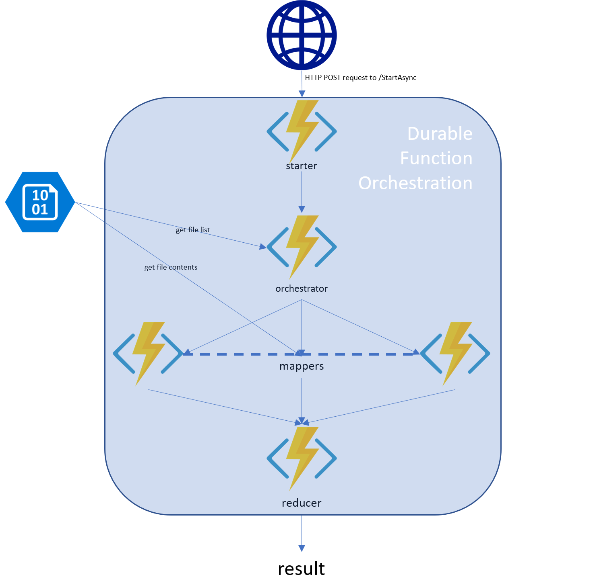
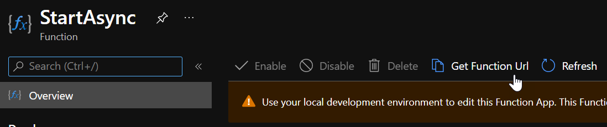

# Big Data Processing: Serverless MapReduce on Azure

### Introduction into MapReduce

**MapReduce** is a programming model that allows processing and generating big data sets with a parallel, distributed algorithm on a cluster.

A MapReduce implementation consists of a:

- ``Map()`` function that performs filtering and sorting, and a

- ``Reduce()`` function that performs a summary operation on the output of the ``Map()`` function

Both the input and output of the MapReduce implementation are ``<key, value>`` pairs:
    ```(input) <k1, v1>``` -> ```map()``` -> ```<k2, v2>``` -> ```combine()``` -> ```<k2, v2>``` -> ```reduce()``` -> ```<k3, v3> (output)```

The model is a specialization of the ```split-apply-combine``` strategy for data analysis and allows for significant increased speed in a multi-threaded implementation.

### Introduction into Durable Functions

**Durable Functions** is an extension of [Azure Functions](https://functions.azure.com) and [Azure WebJobs](https://docs.microsoft.com/en-us/azure/app-service/web-sites-create-web-jobs) that allows writing *long-running*, *stateful* function orchestrations in code in a serverless environment.

This extension enables a new type of function called the *orchestrator function* that allows you to do several new things that differentiates it from an ordinary, stateless function:

* They are stateful workflows **authored in code**. No JSON schema or designers.
* They can *synchronously* and *asynchronously* **call other functions** and **save output to local variables**.
* They **automatically checkpoint** their progress whenever the function awaits so that local state is never lost if the process recycles or the VM reboots.

#### Durable Functions: Fan-out/fan-in ####

One of the typical application patterns that can benefit from Durable Functions is the fan-out/fan-in pattern.

<p align="center">

</p>

With normal functions, fanning out can be done by having the function send multiple messages to a queue. However, fanning back in is much more challenging. You'd have to write code to track when the queue-triggered functions end and store function outputs. The Durable Functions extension handles this pattern with relatively simple code:
```csharp
public static async Task Run(DurableOrchestrationContext ctx)
{
    var parallelTasks = new List<Task<int>>();

    // get a list of N work items to process in parallel
    object[] workBatch = await ctx.CallActivityAsync<object[]>("F1");
    for (int i = 0; i < workBatch.Length; i++)
    {
        Task<int> task = ctx.CallActivityAsync<int>("F2", workBatch[i]);
        parallelTasks.Add(task);
    }

    await Task.WhenAll(parallelTasks);

    // aggregate all N outputs and send result to F3
    int sum = parallelTasks.Sum(t => t.Result);
    await ctx.CallActivityAsync("F3", sum);
}
```

In the example above, the fan-out work is distributed to multiple instances of function `F2`, and the work is tracked by using a dynamic list of tasks. The .Net `Task.WhenAll` API is called to wait for all of the called functions to finish. Then the `F2` function outputs are aggregated from the dynamic task list and finally passed on to the `F3` function.

The automatic checkpointing that happens at the await call on `Task.WhenAll` ensures that any crash or reboot midway through does not require a restart of any already completed tasks.

> **Note:** You can read more about Durable Functions here: <https://docs.microsoft.com/en-us/azure/azure-functions/durable-functions-overview>

### Prerequisites
Before you open or build the solution in this repo, make sure you have the following:
- An active [Microsoft Azure](https://azure.microsoft.com/en-us/free) Subscription (available free!)
- [Optional] [Visual Studio 2017](https://visualstudio.microsoft.com/ "Click to see all offerings") [Community Edition](https://visualstudio.microsoft.com/thank-you-downloading-visual-studio/?sku=Community&rel=15# "Download Community Edition now") (free!)

If you don't (want to) install Visual Studio and deploy via 'Publish', check the [Visual Studio-less deployment environment setup](#visual-studio-less-deployment-environment-setup) section below to see if you need to run the setup script included in this repo to grab other bits necessary for automatic deployment.

## Visual Studio-less deployment environment setup
You can set up your PC environment to enable deployment of this solution without installing Visual Studio by executing the `SetupEnvironment.ps1` PowerShell script **from an Administrator PowerShell instance**.

> Note: If you've never run PowerShell scripts on your computer, you'll need to change the Execution Policy to allow script running by executing `Set-ExecutionPolicy Bypass -Scope Process -Force` before running the above command. Using `-Scope Process` here ensures ExecutionPolicy isn't permanently set to allow scripts on your machine, but rather just while you're doing the import

This performs the following **permanent** changes to your machine:
- Installs [Chocolatey](https://chocolatey.org) (for package installation automation)
- Installs [Azure PowerShell](https://docs.microsoft.com/en-us/powershell/azure/install-azurerm-ps?view=azurermps-6.8.1#requirements)
- Installs [.Net Core SDK](https://www.microsoft.com/net/download) (to build v2 app)
- Installs [.Net 4.6.1 Developer pack](https://www.microsoft.com/en-us/download/details.aspx?id=49978) (to build v1 app)

## 1. Serverless MapReduce on Azure ##

<p align="center">

</p>

The above diagram shows the architecture a MapReduce implementation generally follows.

In this sample you will find handful of Azure Functions comprising a **Mapper** and **Reducer** to determine the **average speed** of New York Yellow taxi trips, **per day** over all of 2017.

You will use ***Durable Functions*** - specifically the ***Fan-out/Fan-in pattern*** - to distribute the workload across multiple instances of the Mapper then coordinate the outputs in to the Reducer and finally return the computed values for each day.

The source data you will be using for this MapReduce implementation can be found here: <http://www.nyc.gov/html/tlc/html/about/trip_record_data.shtml>
and contains 12 CSV files of roughly 800MB each (`Yellow` dataset) you need to make available in Azure Blob storage - total size is ~9.6GB.

## 2. Hands on: Implementing the MapReduce pattern step by step ##
### 2.1 Copy the dataset to an Azure Blob Storage instance
Open a new PowerShell window & execute `TaxiDataImporter.ps1` from the repo directory to copy each file from the NYC Taxi site in to your Azure Storage Account

You'll be asked to provide the following:
- A connection string to your Azure Storage account
- The container name within the storage account into which to copy the data

> Note: If you wish to specify a subfolder, you'll need to execute the cmdlet with the `-subfolderName` parameter; it won't prompt you for it because it's optional. You can get examples of usage with `Get-Help Import-TaxiDatasetToAzureStorage` 

The copy will kick off and should only take a couple of minutes as **you're using Azure's bandwidth to do the downloading**, not your own.

### 2.2 The code
Open ServerlessMapReduce.sln in Visual Studio
You'll first notice there are two projects in the solution. One is a Function v2 (.Net Standard) project, the other is a Function v1 (.Net 4.x aka "netfx") project. **The code for each project is identical, and shared between the two via linked files.**

#### Sample.cs
This is where all our MapReduce logic lies. Let's have a look

##### StartAsync
The entry point to our Durable Orchestration, this method is triggered by an HTTP request to the Function which contains a single `path` query parameter specifying the URL to the blob storage account containing the files to process. Example: 
~~~
POST /api/StartAsync?code=Pd459lsir2CILjc8jRAkO6TLy3pasuBDikYZMZRKAjaTgjh00OW2wg==&path=https://mystorage.blob.core.windows.net/newyorkcitytaxidata/2017/yellow_tripdata_2017 HTTP/1.1
Host: myfunction.azurewebsites.net
Cache-Control: no-cache
~~~
Note the format of the `path` variable. It's not only used to denote the container in which to look, but also the prefix to use when searching for the files. You can, therefore, get as arbitrary or specific as you want but *if you have the files in a subfolder you **must** specify it*.

Once StartAsync is kicked off, it parses out the container name and prefix from the `path` parameter and kicks off a new orchestration with `BeginMapReduce` as the entry point

##### BeginMapReduce
This is the *actual* orchestrator for the entire process. First, we retrieve all the blobs from the storage container which match the prefix, using the Activity function `GetFileListAsync`. We must do this as the queries to Blob Storage are asynchronous and therefore [cannot live inside an orchestrator function](https://docs.microsoft.com/en-us/azure/azure-functions/durable-functions-checkpointing-and-replay#orchestrator-code-constraints).

After getting the list of files to include it then spins up a mapper for each, in parallel:
```csharp
var tasks = new Task<double[]>[files.Length];
for (int i = 0; i < files.Length; i++)
{
    tasks[i] = context.CallActivityAsync<double[]>(
        nameof(MapperAsync),
        files[i]);
}
```
We add the resulting `Task<T>` object from these calls to an array of Tasks, and we wait for them all to complete using `Task.WhenAll()`

Once they've completed, we've got mappers created for each file and it's time to reduce them. We do this by calling out *once* to another activity function: `Reducer`. This function does the math to aggregate the average speed computed for each day of the week in each line of the files in to an overall average across all the files for each day of the week.

After this, we return the result as a string back to the Orchestrator (`BeginMapReduce`) who sets this as `output` for the entire orchestration which the caller can discover by issuing an HTTP GET to the status API:
~~~
GET /admin/extensions/DurableTaskExtension/instances/14f9ae24aa5945759c3bc764ef074912?taskHub=DurableFunctionsHub&amp;connection=Storage&amp;code=ahyNuruLOooCFiF6QB7NaI6FWCHGjukAdtP/JGYXhFWD/2lxI9ozMg== HTTP/1.1
Host: myfunction.azurewebsites.net

{
    "instanceId": "14f9ae24aa5945759c3bc764ef074912",
    "runtimeStatus": "Completed",
    "input": {
        "$type": "<>f__AnonymousType0`2[[System.String, mscorlib],[System.String, mscorlib]], ServerlessMapReduce.v1",
        "containerUrl": "https://mystorage.blob.core.windows.net/newyorkcitytaxidata/",
        "prefix": "2017/yellow_tripdata_2017-1"
    },
    "customStatus": null,
    "output": "Sun: 14.7773480317865, Mon: 13.412296342264, Tue : 12.0879698292105, wed: 12.1794013570501, Thu: 12.0085449069425, Fri: 12.4839412962461, Sat: 12.8889347824278",
    "createdTime": "2018-08-29T17:52:41Z",
    "lastUpdatedTime": "2018-08-29T18:00:42Z"
}
~~~

> Note: Give this Status API a hit while the orchestration is running and you'll get an idea of where it's at in the process due to the calls to `SetCustomStatus` throughout the code

## Deployment
There are two ways to choose from to deploy this solution to your own Azure subscription:
### Visual Studio
Right-click either/both of the project(s) and choose 'Publish...' 
- Walk through the wizard to create
  - App service plan
  - Storage account
  - Function app instance

### PowerShell
> **Important**: Run `deploy.ps1` in a new PowerShell window only _after_ you've executed `SetupEnvironment.ps1`. This refreshes environment variables so the build & deploy commands will execute successfully

Execute `deploy.ps1` providing:
- Subscription ID
- Base name for resources

> Note: By default all resources will be provisioned in the West US 2 region of Azure. If you wish to have them somewhere else, provide the `-region` parameter to the deployment script

and the following will be provisioned for you
- New Resource group
- 2 Application Insights instances (one for each of v1 and v2 Function apps)
- 2 Storage accounts
- 1 Consumption App Service Plan
- 2 Function Apps

Naming of the Function App and Application Insights instances will follow (base name)+v1/v2
Naming of the Storage Accounts will follow (base name)+storv1/storv2

## Execution / testing
After deployment:
- Visit your Function App in the Azure Portal
- Click the `StartAsync` function 
- Click 'Get function URL' & copy it for usage in your favorite REST API testing program
<p align="center"></p>

- Issue an HTTP POST to that endpoint with the `path` parameter populated from the output of the PowerShell script you ran in [2.1](#21-copy-the-dataset-to-an-azure-blob-storage-instance)

You'll receive back a list of URLs you can use to check status, issue new events (not handled by this sample), or terminate the orchestration.

# Notes
The implementation shown here utilizes a single reducer. If you needed multiple reducers, you would create **a sub-orchestration per reducer**, launch those in parallel, do the `CallActivityAsync()` calls within the sub-orchestrator, reduce the results, pass that up to the parent orchestrator to further reduce the results, and so on.

It's also important to remember while Serverless technologies allow you to scale "infinitely" we must use the right tool for the right job. Durable Functions will, in theory, scale out to run any number of jobs in parallel and come back to the reduce step so **this approach may work very well for loads that can be highly parallelized** however the machines on which Azure Functions run (in Consumption plan) are of limited specs ([more detail can be found here in the docs](https://docs.microsoft.com/en-us/azure/azure-functions/functions-scale#how-the-consumption-plan-works)). This means **this approach _may not_ work well for loads with very large sections to be processed by each mapper**. In this case, you may look in to hosting this implementation on an App Service Plan with large VMs or, even better, a Functions Premium offering with a large VM size to process the data more quickly. Another thing to note is the way DF passes results and parameters around; these are done via Azure Storage Queues which may/may not add unacceptable latency in to your big data process.
